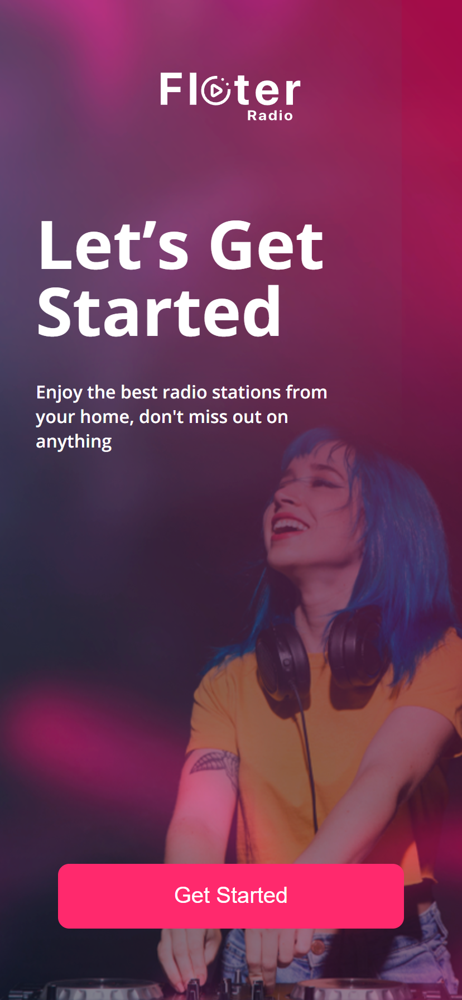

# Radio App

  
  

## Projeto desenvolvido utilizando:
- Javascript
- React Js
- React-Router-Dom

### Projeto desenvolvido para treinar minhas habilidades na biblioteca ReactJs, utilizando também bibliotecas externas como React Router Dom para manipulação das páginas da aplicação.
